# Glucose Grand Prix  
*Visualise your daily blood sugar as a Formula 1 race.*

Author: Richard Hall  
[LinkedIn](https://www.linkedin.com/in/rilhia/)  
[EarthTunnelling.com](https://earthtunnelling.com)

---

## 📖 Introduction

**Glucose Grand Prix** is a quirky project I put together after finding a neat way to extract my blood sugar data from [Glooko](https://glooko.com/). I wanted to create my own charts, but the data downloads only allowed 90 days at a time and came as multiple CSV files bundled in a ZIP. It was not exactly user-friendly.

With a bit of hacking around, I discovered how to use their session-authenticated browser APIs. That meant I could now grab all my data (or just a few hours’ worth) in JSON format using Chrome’s DevTools. Perfect.

At first, I thought it would be a great trick to share with other Glooko users. Then I remembered not everyone is quite as obsessed with data as I am. That thought completely sidetracked me. I started wondering what someone else might actually do with this data.

I’d recently seen stories about a diabetic Barbie and a diabetic Marvel superhero. Both were created for kids, which is a lovely idea. But not all kids relate to dolls or superheroes. There are loads of kids (and adults) who are really into F1.

That’s when it hit me. What if I could use glucose data to “fuel” Formula 1 cars? Just like that, the idea of Glucose Grand Prix was born. A webpage that turns your blood sugar readings into something a bit different. A race car tearing around a virtual F1 track.

Each day’s data becomes a lap. Each data point becomes a step forward. Your glucose control becomes the determining factor in how smoothly your car makes it around the track. The better your day, the faster and cleaner the lap.

This project is a proof of concept. It'll be open to anyone who wants to try it or enhance it. 

---

## 🛠️ What this project does

This is a browser-based web app (no install needed!) that:

- Loads your blood glucose data from a JSON file  
- Animates multiple days as racing laps around a real F1 circuit  
- Maps glucose control to car speed, using Gaussian scoring  
- Shows leaderboard-style stats like time-in-range, high/low/mid, and deviation  
- Lets you choose which F1 drivers to include  
- Includes multiple tracks with real F1 circuit data
- The result of the race reveals your best days with regard to control
- You can download the details of your best days

**What it doesn't do:**

- Upload your data anywhere (everything runs in the browser)  
- Require any medical device integration (you load your JSON manually)

---

## 📤 How to Extract Your Glooko Data via Chrome DevTools

This guide shows how to extract your own Glooko data using the browser's built-in developer tools.  
No scripts. No extensions. Just you, Chrome, and a little patience. Once you have followed this step, you can use the data you have collected to run the **Glucose Grand Prix**.

> ⚠️ **Note:** This method uses the same session your browser is already logged into.  
> It is secure and personal. The data is never shared unless *you* choose to download or use it elsewhere.

---

## 🧭 Step-by-Step Instructions

1. **Open [Glooko](https://my.glooko.com/)** and log in as usual. You should land on the **Summary** page.  
   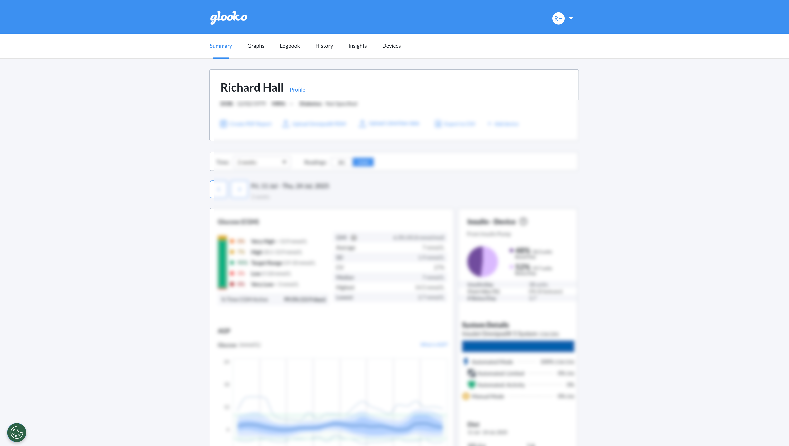

2. Click on the **Graphs** tab to load your glucose history.  
   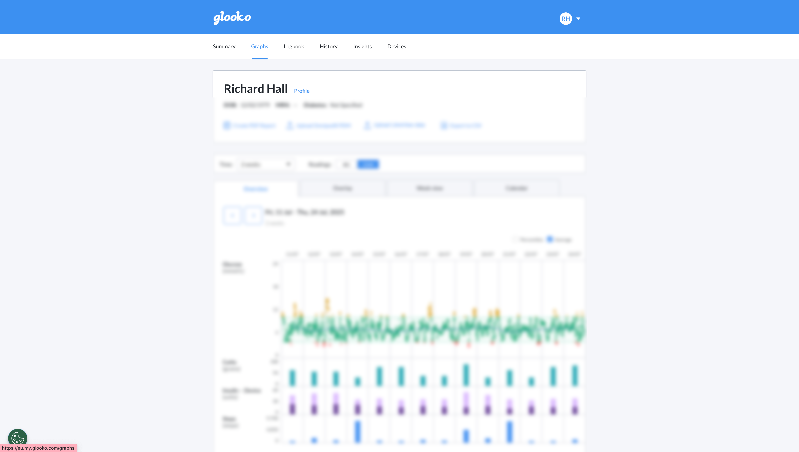

3. **Open DevTools**:  
   - Right-click anywhere on the page and select **Inspect**,  
   - or press `Cmd + Option + I` (Mac) / `Ctrl + Shift + I` (Windows).
   
   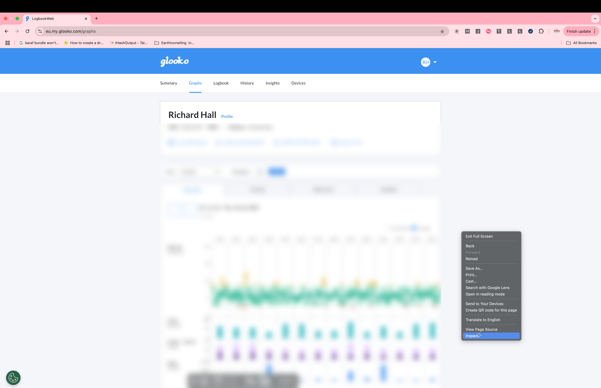

4. In the DevTools panel, click the **Network** tab.  
   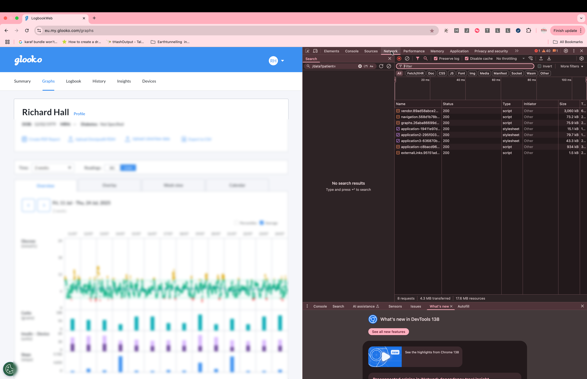

5. **Reload the page** (`Cmd + R` or `F5`) to capture the network traffic.  
   

6. In the **filter/search bar**, type `/data?patients=`  
   This narrows the requests down to the one you want.  
   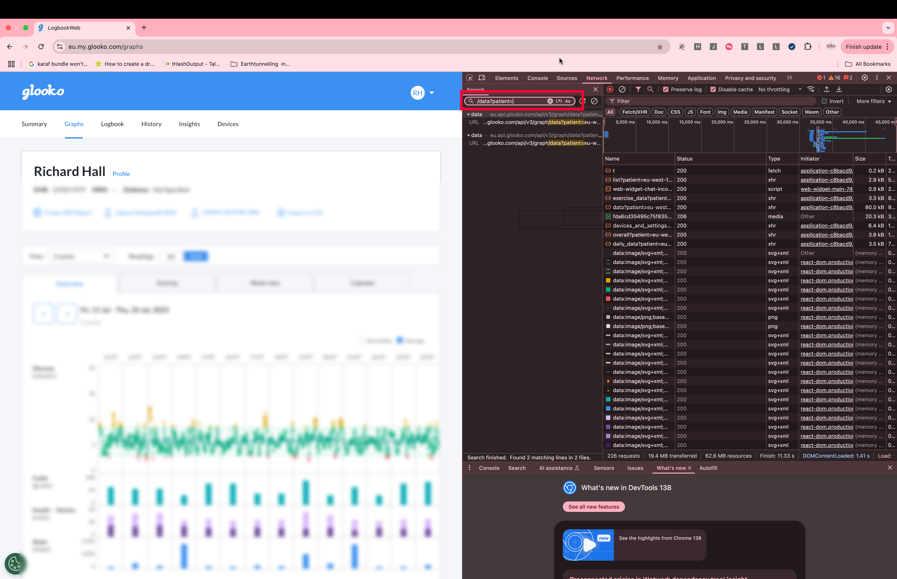
   

7. You'll see **one, two, possibly many results**. Click on each one and inspect the **Response** tab.  
   The one that contains **JSON data** is the one you want.  
   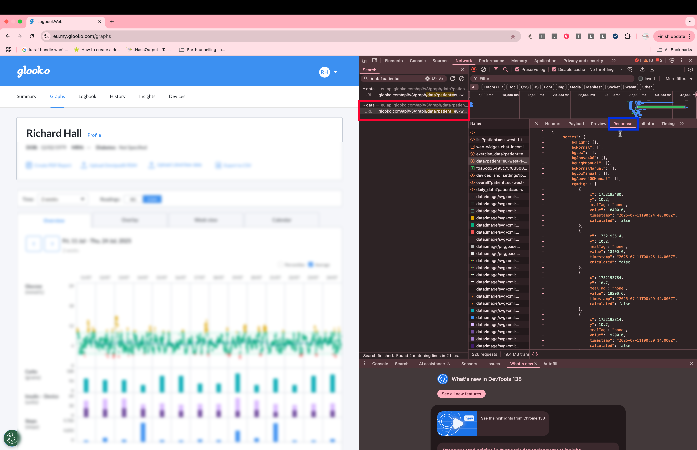
   

8. Go to the **Headers** tab of that request and copy the **Request URL**.  
   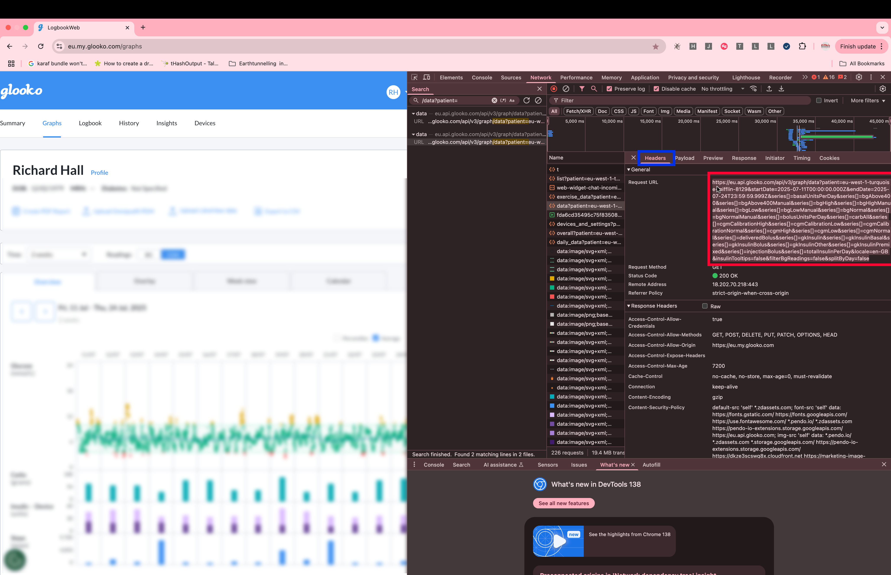

9. Paste the URL into a **text editor**. It’s long, so this will help you edit it cleanly.  
   Look for a section like this:  

   ```
   startDate=2025-07-07T00:00:00.000Z&endDate=2025-07-20T23:59:59.999Z
   ```
   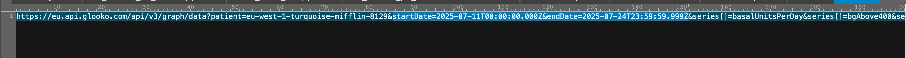

10. Modify the **`startDate`** and **`endDate`** to match the time range you want.  
    For example, changing the **`startDate`** year from 2025 to 2023 allows us to pull an extra two years' worth of data:
     
    ```
    startDate=2023-07-07T00:00:00.000Z&endDate=2025-07-20T23:59:59.999Z
    ```
   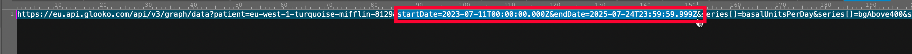

11. Now, paste the edited URL into your **browser’s address bar**, in a tab where you're still logged into Glooko.  
    Hit enter.
   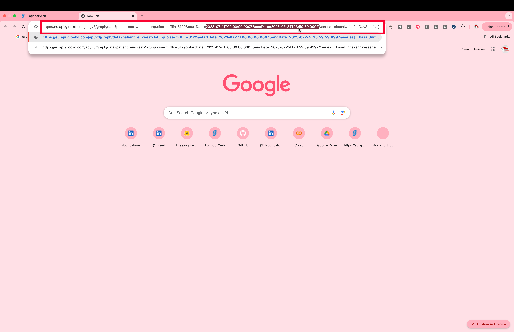
   

12. **Wait a moment.** If you're requesting a lot of data (like 2 years), it may take some time.  
    When it loads, you’ll see a screen filled with **raw JSON text**.

13. Select all the text (`Cmd + A`, then `Cmd + C`) and paste it into your text editor.
   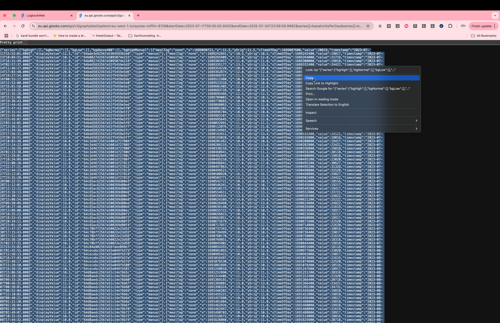
14. Save the file with a `.json` extension (e.g. `glooko_data.json`).
   
   
---

🎉 **Done!** You’ve now extracted your data. This file can now be used in your own visualisations, backups, or with projects like **Glucose Grand Prix**.

---

## 🚀 How to use this

1. **Download and open the HTML file**
   Download the [webpage](https://raw.githubusercontent.com/rilhia/glucose-grand-prix/main/glucose-grand-prix.html) or [run it](https://rilhia.github.io/glucose-grand-prix/) from GitHub and double click on it to open it in a browser.
   
2. **Prepare your data**  
   Download your data from Glooko, paste it into a file, give the file a name with the suffix ".json", then click "Load JSON" to load it.

3. **Pick a track**  
   Choose from real F1 circuits like Silverstone, Yas Marina, or Monza.

4. **Start the race**  
   Press **Start Race** and watch your data come to life!

---

## 🎯 Customisation Ideas

- Add a multi-user "competitive" feature and compete with diabetic friends 
- Change how performance is calculated (edit `getPerformance()`)    
- Show month-over-month comparison laps
- Get Glooko to include features like this into their website 

---

## 📝 License

This project is licensed under the MIT License. You can use, modify, and distribute it freely as long as attribution is preserved.

---

## 🧠 Final Thoughts

The Glucose Grand Prix isn’t a replacement for traditional analysis. It’s a *complement*. A way to think differently about daily patterns, to stay engaged, and — frankly — to have a little fun.

If you build on it, I’d love to see what you create. Feel free to fork, remix, or race your own way.

---

**Stay steady. Stay fast.**
