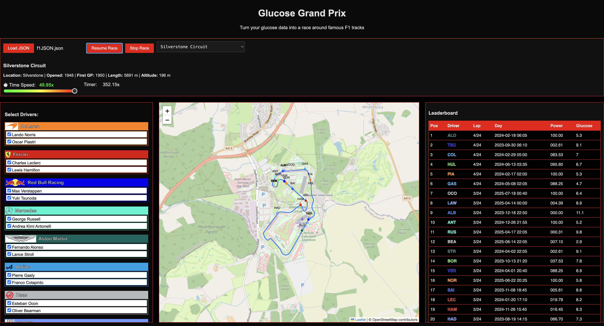

# Glucose Grand Prix  
*Visualise your daily blood sugar as a Formula 1 race.*

Author: Richard Hall  
[LinkedIn](https://www.linkedin.com/in/rilhia/)  
[EarthTunnelling.com](https://earthtunnelling.com)

---

## 📖 Introduction

**Glucose Grand Prix** is a quirky project I put together after finding a neat way to extract my blood sugar data from [Glooko](https://glooko.com/). I wanted to create my own charts, but the data downloads only allowed 90 days at a time and came as multiple CSV files bundled in a ZIP. It was not exactly user-friendly.

With a bit of hacking around, I discovered how to use their session-authenticated browser APIs. That meant I could now grab all my data (or just a few hours’ worth) in JSON format using Chrome’s DevTools. Perfect.

At first, I thought it would be a great trick to share with other Glooko users. Then I remembered not everyone is quite as obsessed with data as I am. That thought completely sidetracked me. I started wondering what someone else might actually do with this data.

I’d recently seen stories about a diabetic Barbie and a diabetic Marvel superhero. Both were created for kids, which is a lovely idea. But not all kids relate to dolls or superheroes. There are loads of kids (and adults) who are really into F1.

That’s when it hit me. What if I could use glucose data to “fuel” Formula 1 cars? Just like that, the idea of Glucose Grand Prix was born. A webpage that turns your blood sugar readings into something a bit different. A race car tearing around a virtual F1 track.

Each day’s data becomes a lap. Each data point becomes a step forward. Your glucose control becomes the determining factor in how smoothly your car makes it around the track. The better your day, the faster and cleaner the lap.

This project is a proof of concept. It'll be open to anyone who wants to try it or enhance it. 
---

## 🛠️ What this project does

This is a browser-based web app (no install needed!) that:

- Loads your blood glucose data from a JSON file  
- Animates multiple days as racing laps around a real F1 circuit  
- Maps glucose control to car speed, using Gaussian scoring  
- Shows leaderboard-style stats like time-in-range, high/low/mid, and deviation  
- Lets you choose which drivers (days) to include  
- Includes multiple tracks with real F1 circuit data

**What it doesn't do:**

- Upload your data anywhere (everything runs in the browser)  
- Require any medical device integration (you load your JSON manually)

---

## 🚀 How to use this

1. **Prepare your data**  
   Your JSON file should follow the format exported by the CGM simulator or from your own tool — with arrays like `cgmLow`, `cgmNormal`, and `cgmHigh`, and each entry containing `timestamp`, `x` (epoch), and `y` (bg value).

2. **Open the web app**  
   You can host it yourself from GitHub Pages, or just open the HTML file in your browser.

3. **Load your file**  
   Click the **Load JSON** button, select your file, and wait a second or two for parsing.

4. **Pick a track**  
   Choose from real F1 circuits like Silverstone, Yas Marina, or Monza.

5. **Start the race**  
   Press **Start Race** and watch your data come to life!

---

## 🎯 Customisation Ideas

- Add your own circuits (just import GeoJSON files with line data)  
- Change how performance is calculated (edit `getPerformance()`)  
- Use it for competitions — who had the best lap today?  
- Animate multiple users  
- Show month-over-month comparison laps  

---

## 📝 License

This project is licensed under the MIT License. You can use, modify, and distribute it freely as long as attribution is preserved.

---

## 🧪 Demo and Screenshots

Demo coming soon.

You can also preview it live at: *(GitHub Pages link, if deployed)*

---

## 🧠 Final Thoughts

The Glucose Grand Prix isn’t a replacement for traditional analysis. It’s a *complement*. A way to think differently about daily patterns, to stay engaged, and — frankly — to have a little fun.

If you build on it, I’d love to see what you create. Feel free to fork, remix, or race your own way.

---

**Stay steady. Stay fast.**
